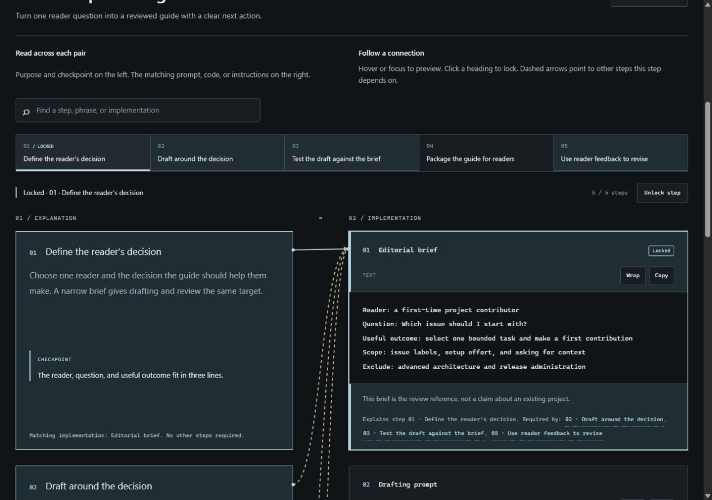

# Workflow Display

Turn a workflow into **paired explanations and concrete artifacts**, with smooth unfolding and animated connections. Inspired by Boomer Rawlings' paired implementation walkthrough. The relationships and motion are the pattern; the colors are yours.

[Live demo](https://boomerrawlings.com/workflow-display/) · [Agent instructions](SKILL.md) · [Data schema](references/schema.md) · [Design and integration](references/design.md)



## Try it immediately

Download the package, then open **`demo.html`** in any modern browser. Viewing needs no Node.js, account, server, or install. The generated display is a single file and works offline; optional resource links open external sites only when clicked.

## Build your own

Prerequisite: **Node.js 18+**. The generator uses Node's standard library; no npm dependencies, bundler, or API key.

```sh
git clone https://github.com/BoomerRawlings/Skills.git
cd Skills/skills/workflow-display
node scripts/build.mjs --data examples/content-pipeline.json --out workflow.html
```

Open `workflow.html`. Copy either example JSON, replace its content, then rebuild:

```sh
node scripts/build.mjs --data my-workflow.json --out my-workflow.html
```

The generator refuses to overwrite existing files. Add `--force` when intentionally updating your output. `--help` lists options. Running without options builds the content-pipeline example into `workflow.html` in your current directory.

Each step has two sides:

| Explanation | Concrete artifact |
| --- | --- |
| What happens, why, and what to check | The actual prompt, code, checklist, template, or sample output |

Add `related` IDs to the consuming step: `A.related: ["B"]` means A depends on B's implementation. Hover or focus a card to trace its connections; click its heading to lock them. Use multiple `plans` for alternate workflows or distinct processes. [Schema reference](references/schema.md) includes a minimal complete example.

## Give it to an agent

Paste this into an agent that can read GitHub and write local files:

```text
Use the Workflow Display skill:
https://github.com/BoomerRawlings/Skills/tree/main/skills/workflow-display

Read SKILL.md, download the entire skill folder including assets and scripts,
and turn the workflow below into an interactive HTML display. Preserve the
real explanation/artifact pairs and their dependencies. Use smooth unfolding
and animated connections; adapt the theme to my preference. Validate the JSON,
build the file, and check it in a browser if available. Return the HTML and
editable JSON. My workflow: [paste steps, prompts, code, outputs, and links].
```

For an agent without GitHub access, attach the downloaded folder or archive and ask it to read `SKILL.md`. Merely attaching that file omits the renderer and generator needed for the fastest path.

For Codex, copy the complete `workflow-display` folder into `$CODEX_HOME/skills/` (normally `~/.codex/skills/`), then invoke `$workflow-display`. The instructions also work as a regular Markdown playbook in other agents; their skill installation locations vary.

## Customize or integrate

- **Content:** edit JSON. No HTML editing required.
- **Long artifacts:** line spacing and alignment are preserved; scroll inside the artifact, or use its Wrap button for prose.
- **Theme:** edit `assets/workflow.css`, then rebuild.
- **Behavior/layout:** adapt `assets/workflow.js` and `assets/template.html`. Retain paired steps, meaningful connections, keyboard access, and reduced-motion support.
- **Hosting:** upload the generated HTML to any static host, or embed it in an iframe. For native app integration, reuse the schema and interaction pattern; see [design guidance](references/design.md).

Artifact text is displayed, never executed. HTML and Markdown inside JSON remain literal text. The generator rejects unsafe resource URL schemes and missing or invalid relationships; it does not verify whether the underlying workflow is correct.

## Examples and checks

`examples/content-pipeline.json` demonstrates editorial publishing and reuse. `examples/research-review.json` demonstrates evidence review and decision tracking. Both contain meaningful cross-step relationships and fictional sample artifacts.

```sh
node scripts/validate.mjs examples/research-review.json
node --test tests/workflow.test.mjs
```

Automated checks cover schema failures, unsafe URLs, embedded data escaping, file protection, and direct generation. Browser checks remain necessary after changing layout or interactions.

MIT licensed within this folder; see [LICENSE](LICENSE). No visible credit required; retain the included license notice when redistributing code.
